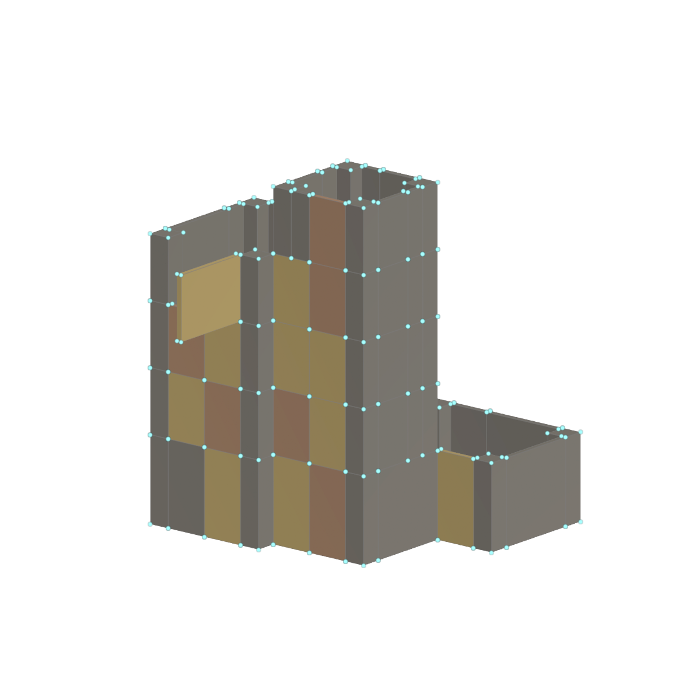

# Houdini Procedural Building — Full Source

A procedural apartment-building HDA that generates modular layout and instance attributes for Unreal Engine. This repository contains the original HDA definition and the complete, unabridged VEX from all **56 script nodes**.

## Start here

- [All 56 nodes, grouped by function](docs/NODE_INDEX.md)
- [The six algorithms shown on portfolio page 04](docs/PORTFOLIO_CODE_MAP.md)
- [Original HDA definition](hda/object_REX.dev.HDA_BlockStack_Building_V2.2.0.hda)
- [Node types and input connections](hda/node_manifest.json)
- [Parameter interface](hda/parameter_interface.ds) and [definition defaults](hda/parameter_defaults.json)
- [Modular asset inventory](tables/asset_inventory_v1_2.csv)

## Generation pipeline

Block placement and support constraints → floor occupancy → exposed boundaries → continuous wall segments → compatible facade replacements → roof and attachment rules → rotation/pivot compensation → Unreal instance points.

The rules use a 100 cm horizontal grid. The documented baseline uses a 400 cm ground floor and 300 cm upper floors. Windows, doors, balconies, floor bands, plants, roof props and pipes use separate placement rules.



The image is a native Houdini 19.5 OpenGL background render of evaluated HDA data using the original debug-box VEX. It shows diagnostic proxy geometry.

## Inspect or run the HDA

1. Open Houdini and install the bundled HDA through Assets → Install Asset Library.
2. Create the Object-level asset with type `REX::dev::HDA_BlockStack_Building_V2::2.0`.
3. Inspect the internal node network and parameter interface. To edit locked internal nodes, allow editing of the asset contents.
4. In Unreal, install a compatible Houdini Engine plugin, import the HDA, and provide the meshes referenced by the asset inventory. Update asset paths and pivot compensation for a different kit.

The source snapshot was exported and checked with **Houdini 19.5.773**. The companion Unreal project uses **UE 5.3**. The `.vfl` files preserve each original node script, including comments and blank lines. They depend on the HDA parameter interface, attributes and upstream geometry; each file is not a standalone program.

To regenerate the readable exports from the bundled HDA, run this in a Houdini command-line environment:

```text
hython tools/export_hda_source.py
```

[`source_manifest.json`](source_manifest.json) records SHA-256 hashes for the HDA and every exported script. The original definition is not modified by the exporter.

## Asset dependencies and current limits

The Unreal meshes, textures and materials referenced under `CityStreetStylizedPack` are external kit assets and are not included. The CSV contains their identifiers, dimensions, placement constraints and object paths. The HDA produces instance points and attributes; Houdini debug boxes do not reproduce the exact Unreal mesh silhouettes.

This repository preserves the existing project state. Some block-proxy and occupancy heights differ; pipe-height controls still need refinement; generic validation flags on attachments require interpretation. A custom `unreal_output_enabled` attribute alone does not establish that Houdini Engine filters invalid points. The disk HDA and a previously imported Unreal asset may differ until reimported.

## 中文说明

仓库保存完整 HDA 定义及全部 56 个 VEX 节点脚本，不删减代码。`vex/` 按原节点名称组织，`hda/` 包含原定义、参数界面、默认值和节点连接；`tables/` 是模块资产表。作品集中的六组代码可通过对应表直接跳转到完整源码。建筑网格、纹理和材质属于外部资产依赖，需要在 UE 中自行提供。
