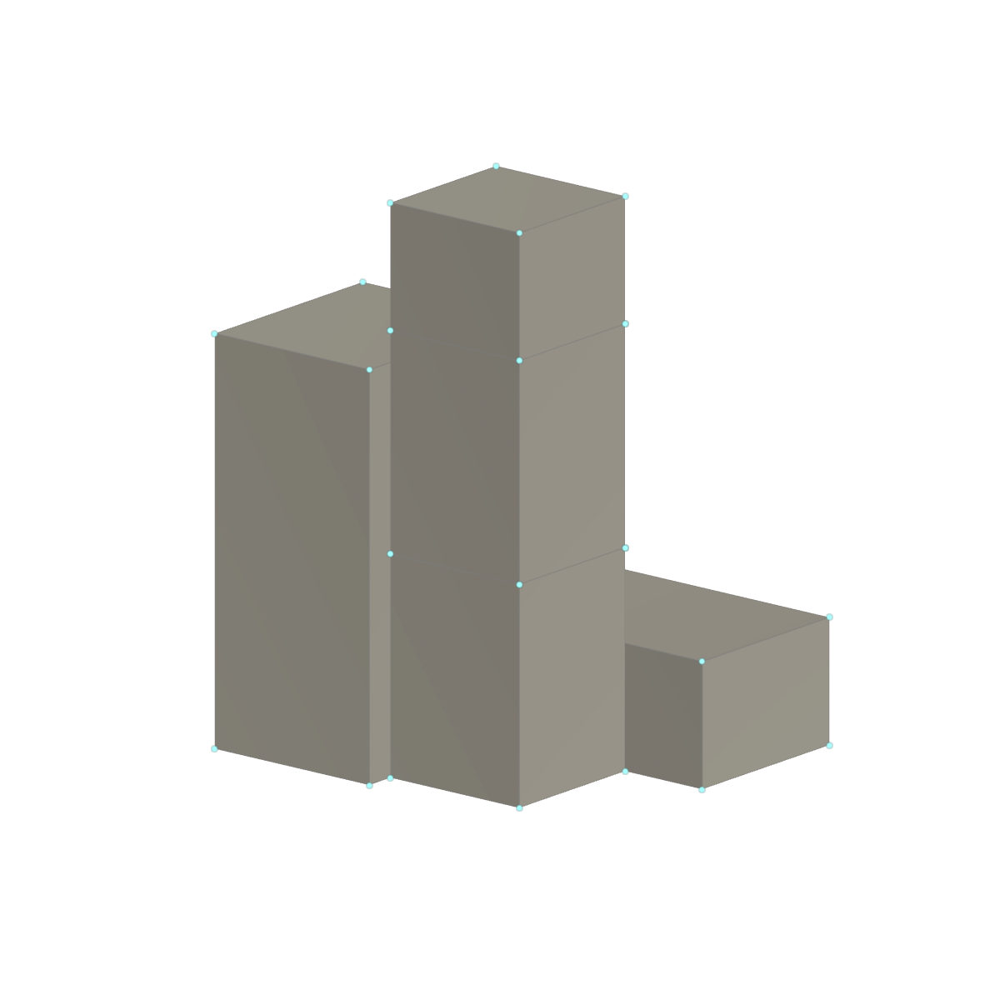
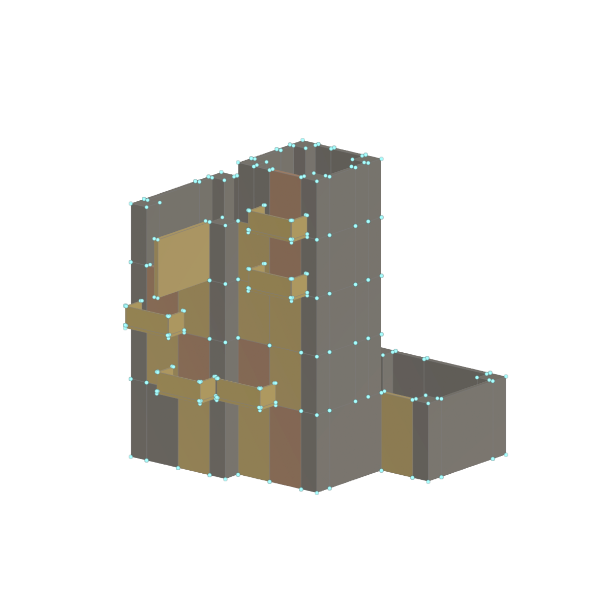
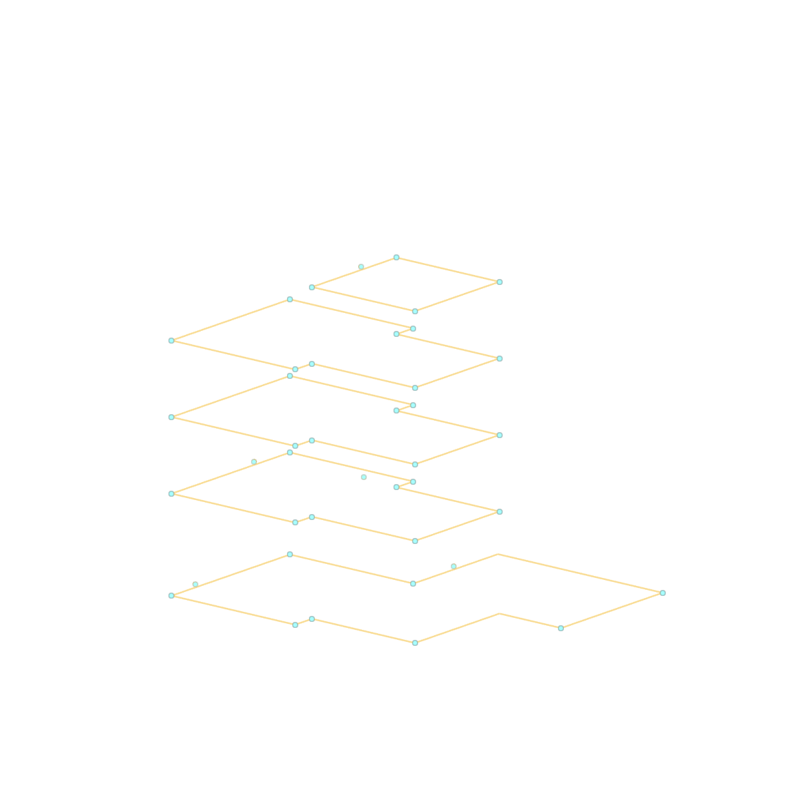
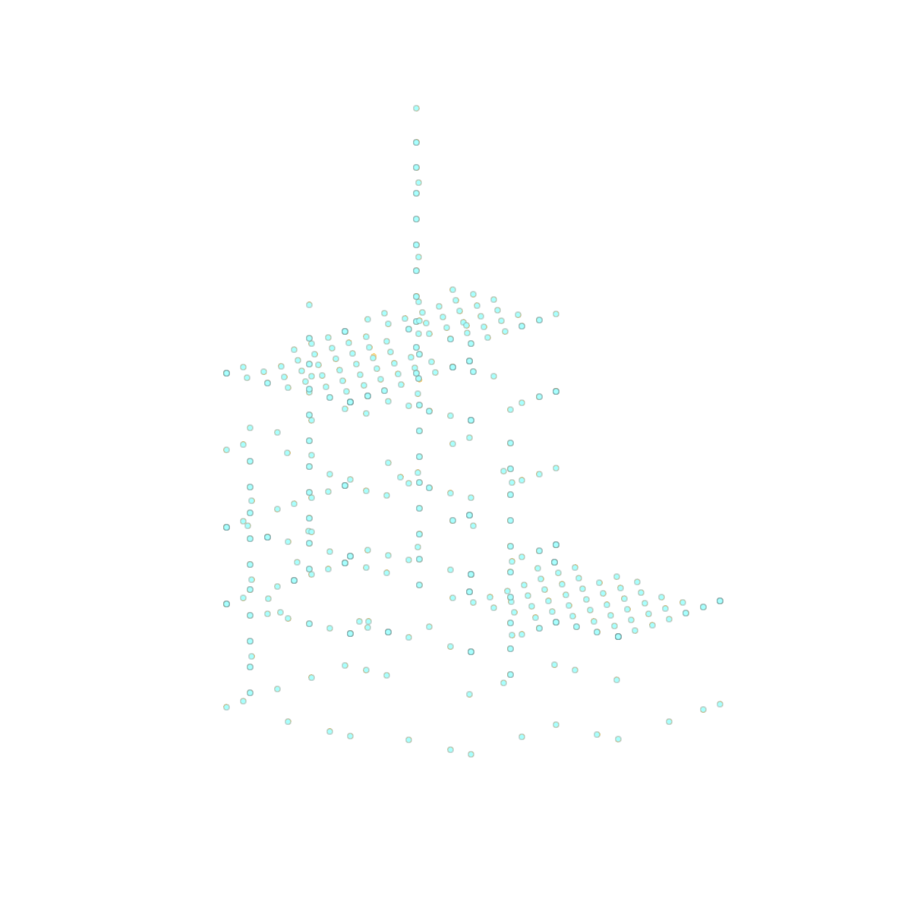

# Portfolio Page 04 — Full Code Map

The portfolio contains selected statements, compacted whitespace and wrapped lines. The files linked below contain the complete surrounding functions, loops and branches. All six pictures are evaluated Houdini outputs rendered with OpenGL, without a foreground screenshot.

## 01 / Support + collision

- [03_BUILDING_BLOCK_DATA](../vex/03_BUILDING_BLOCK_DATA.vfl#L64)

ACTUAL BLOCK PROXY — 5 blocks / seed 03.

## 02 / Boundary → wall runs

- [08_WALL_SEGMENT_DATA](../vex/08_WALL_SEGMENT_DATA.vfl#L83)

ACTUAL WALL-RUN OUTPUT — 38 polylines / 180 edge units.

## 03 / Constrained replacement

- [09L_UPPER_WIDE_WINDOW_REPLACE](../vex/09L_UPPER_WIDE_WINDOW_REPLACE.vfl#L300)

ORIGINAL DEBUG-BOX VEX — Evaluated 09L points / type colors.

## 04 / Semantic balcony anchors

- [22_FRONT_BALCONY_ANCHOR_POINTS](../vex/22_FRONT_BALCONY_ANCHOR_POINTS.vfl#L85)

ORIGINAL BALCONY PROXY — 5 anchors / door-center placement.

## 05 / Spatial exclusion

- [38_PIPE_ANCHOR_POINTS](../vex/38_PIPE_ANCHOR_POINTS.vfl#L239)

ACTUAL PIPE ANCHORS — 5 eligible sites / wall runs as context.

## 06 / Unreal transforms

- [14_FINAL_UNREAL_COMPENSATION_V2](../vex/14_FINAL_UNREAL_COMPENSATION_V2.vfl#L35)
- [10A_NORMALIZE_INSTANCE_SCALE](../vex/10A_NORMALIZE_INSTANCE_SCALE.vfl#L12)
- [09_WALL_MODULE_POINTS](../vex/09_WALL_MODULE_POINTS.vfl#L75)

ACTUAL INSTANCE-POINT OUTPUT — 445 points / UE paths retained.
